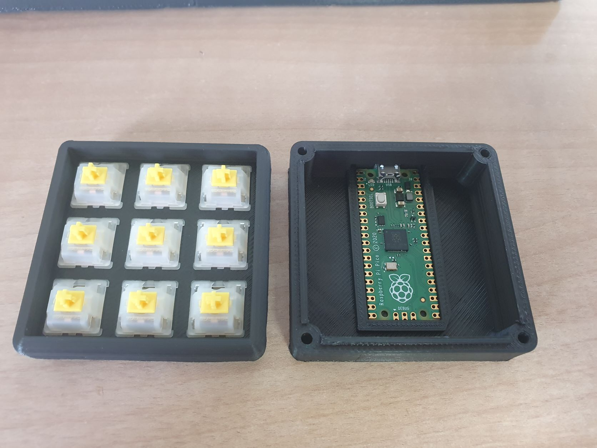
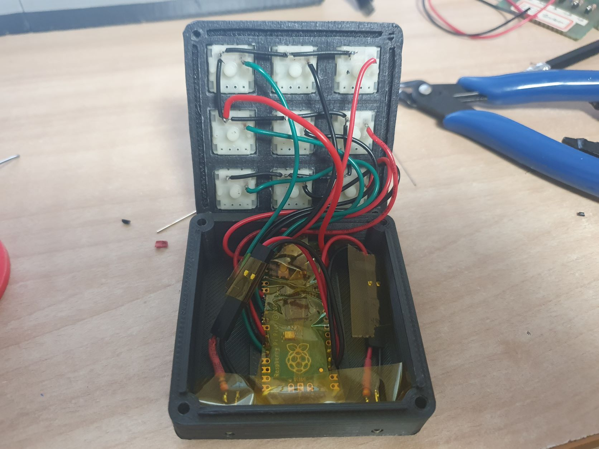
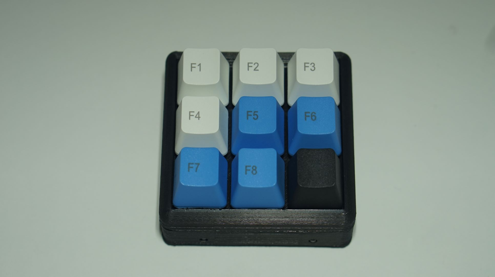

# Raspberry pi pico macro pad
## Macro pad

## 참고
https://create.arduino.cc/projecthub/1Nex tPCB/how-to-build-a-pico-macro-pad-3638e6
https://tutorial.cytron.io/2022/01/11/interface-rfid-rc522-reader-using-maker-pi-pico-and-circuitpython/